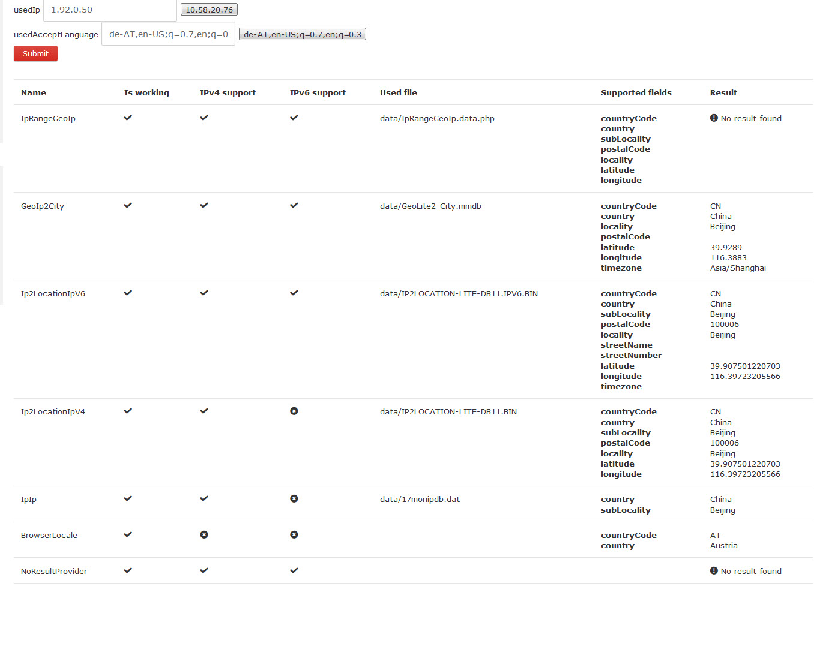

# GeoIpChain - Piwik plugin

*** This is a prototype currently!!! ***

This plugin comes out of the idea here https://github.com/piwik/piwik/issues/6433

Multiple GeoIp provider were not currently possible until yet - with this plugin you can defined as many as you want!



## Installaion
Download this plugin and put it with the name `GeoIpChain` in your `plugins` folder

Run `composer install` inside the plugin to install dependencies

### Configuration

Currently there is no GUI for this task.

Add 1 or all classes below to `config/config.ini.php` - in the order you want

The first provider is used first, if there is no result the 2nd will be used and so on...

```
[GeoIpChain]
providers[] = 'Piwik\Plugins\GeoIpChain\Provider\IpRangeGeoIp'
providers[] = 'Piwik\Plugins\GeoIpChain\Provider\GeoIp2City'
providers[] = 'Piwik\Plugins\GeoIpChain\Provider\Ip2LocationIpV6'
providers[] = 'Piwik\Plugins\GeoIpChain\Provider\Ip2LocationIpV4'
providers[] = 'Piwik\Plugins\GeoIpChain\Provider\BrowserLocale'
providers[] = 'Piwik\Plugins\GeoIpChain\Provider\NoResultProvider'
```

### Provide data files

Data datafiles are searched in `YOUR_PIWIK/data/...

Go to `Settings -> GeoIpChain` to see the current used default filename

## TODO
- [x] create a overview + testpage in the admin section (Settings -> GeoIpChain)
- [ ] configuration GUI
  - [ ] active/deactive providers
  - [ ] order the priority of the providers
  - [ ] change the data file
- [ ] know which provider provides which data (lat/lang, country, street, ...)
- [ ] define all columns
- [ ] add the result it to the `visitor` data
  - [x] added one field: latitude
- [ ] ...and many more (try/catch, caching, ...)
